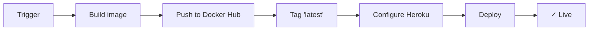

# 221332 - Projetar Aplicacoes Baseadas em IA na Nuvem

## 🎬 Fase 2 - API de Análise de Sentimento

API REST de **análise de sentimento de sinopses de filmes** com NLP avançado, autenticação segura, containerização Docker e deploy automático na nuvem.

### Características Principais

✅ **API REST moderna** com FastAPI documentada automaticamente (Swagger)  
✅ **Autenticação por chave de API** com validação segura  
✅ **Pipeline NLP completo:** tokenização, stemming, lemmatização, POS tags, TF-IDF, análise de sentimento  
✅ **Containerização Docker** com imagem otimizada  
✅ **CI/CD automático** com GitHub Actions (testes, build, deploy)  
✅ **Deploy Heroku** via Docker Hub registry  

### 👥 Integrantes

- Alysson Leandro Nascimento de Oliveira
- Edcarla Sousa de Jesus
- Nereu Necholson Vieira de Lacerda Junior

### 📁 Estrutura do Projeto

```
.
├── api.py                                    # Aplicação FastAPI e rotas
├── preprocessing.py                          # Pipeline de NLP
├── dataset_tmdb_completo.csv                 # Base de dados (5.000+ filmes)
├── requirements.txt                          # Dependências Python
├── Dockerfile                                # Imagem Docker otimizada
├── 221332_PROJETAR_APLICACOES_BASEADAS_EM_IA_NA_NUVEM.ipynb
├── README.md
└── tests/
    └── test_api.py                           # Testes unitários pytest

## 🛠 Requisitos

- **Python 3.11+**
- **pip** ou **poetry** para gerenciar dependências
- **Docker** (opcional, para containerização)

### Dependências Principais

- `fastapi` - framework web assíncrono
- `uvicorn` - servidor ASGI
- `spacy` - NLP industrial
- `nltk` - biblioteca de processamento de linguagem natural
- `textblob` - análise de sentimento
- `scikit-learn` - machine learning (TF-IDF)
- `pandas` - manipulação de dados

---

## ⚡ Início Rápido

### 1️⃣ Instalação Local

```bash
# Clonar repositório
git clone https://github.com/seu-usuario/221332-fase2.git
cd 221332-fase2

# Criar ambiente virtual (opcional mas recomendado)
python -m venv venv
# Windows
venv\Scripts\activate
# Linux/macOS
source venv/bin/activate

# Instalar dependências
pip install -r requirements.txt

# Baixar modelos NLP
python -m spacy download en_core_web_sm
```

### 2️⃣ Executar Localmente

**Com variável de ambiente customizada:**

```bash
# Windows (PowerShell)
$env:API_KEY="sua-chave-segura"
$env:PORT="8000"
python api.py

# Windows (CMD)
set API_KEY=sua-chave-segura
set PORT=8000
python api.py

# Linux/macOS
export API_KEY="sua-chave-segura"
python api.py
```

**Sem customização (usa valores padrão):**

```bash
python api.py
```

### 3️⃣ Acessar Documentação

Abra a documentação interativa do Swagger:

- **Swagger UI:** http://localhost:8000/docs
- **ReDoc:** http://localhost:8000/redoc

---

## 🐳 Executando com Docker

### Build da imagem

```bash
docker build -t 221332-fase2-api .
```

### Run do container

```bash
# Com todas as variáveis de ambiente
docker run -p 8000:8000 \
  -e PORT=8000 \
  -e API_KEY="sua-chave-segura" \
  -e DATASET_PATH="dataset_tmdb_completo.csv" \
  221332-fase2-api

# Modo detached (background)
docker run -d -p 8000:8000 \
  -e API_KEY="sua-chave-segura" \
  221332-fase2-api
```

A imagem é otimizada com:
- Base `python:3.11-slim` (60MB)
- Cache pip para renovação rápida
- Modelos NLP pré-baixados

---

## 🔌 Endpoints

### Públicos (sem autenticação)

| Método | Endpoint | Descrição |
|--------|----------|-----------|
| `GET` | `/` | Status da API e informações gerais |
| `GET` | `/health` | Healthcheck para CI/CD e monitoramento |

### Protegidos (requerem header `X-API-Key`)

| Método | Endpoint | Descrição |
|--------|----------|-----------|
| `GET` | `/filme-aleatorio` | Retorna um filme aleatório com sinopses em PT e EN |
| `POST` | `/analisar` | Executa análise de sentimento completa no texto |

---

## 📚 Exemplos de Uso

### 1. Status da API

**Requisição:**
```bash
curl http://localhost:8000/
```

**Resposta:**
```json
{
  "status": "online",
  "descricao": "API 221332 - Fase 2",
  "docs": "/docs",
  "healthcheck": "/health",
  "seguranca": "Envie o cabecalho X-API-Key nas rotas protegidas.",
  "total_filmes": 5043
}
```

### 2. Healthcheck

```bash
curl http://localhost:8000/health
# Resposta: {"status": "healthy"}
```

### 3. Obter Filme Aleatório

**Requisição (cURL - Windows):**
```bash
curl -X GET "http://localhost:8000/filme-aleatorio" ^
  -H "X-API-Key: dev-api-key"
```

**Requisição (Python):**
```python
import requests

headers = {"X-API-Key": "dev-api-key"}
response = requests.get("http://localhost:8000/filme-aleatorio", headers=headers)
print(response.json())
```

### 4. Analisar Sentimento (Principal)

**Requisição (cURL - Windows):**
```bash
curl -X POST "http://localhost:8000/analisar" ^
  -H "Content-Type: application/json" ^
  -H "X-API-Key: dev-api-key" ^
  -d "{\"texto\":\"The movie was absolutely amazing\"}"
```

**Requisição (Python):**
```python
import requests

headers = {
    "X-API-Key": "dev-api-key",
    "Content-Type": "application/json"
}

response = requests.post(
    "http://localhost:8000/analisar",
    headers=headers,
    json={"texto": "The movie was absolutely amazing"}
)

result = response.json()
print(f"Sentimento: {result['sentimento']['classificacao']}")
print(f"Polaridade: {result['sentimento']['polaridade']}")
```

**Resposta (resumida):**
```json
{
  "texto_original": "The movie was absolutely amazing",
  "tokens_nltk": ["The", "movie", "was", "absolutely", "amazing"],
  "stems": ["the", "movi", "wa", "absolut", "amaz"],
  "lemmas": ["The", "movie", "be", "absolutely", "amazing"],
  "pos_tags": [
    {"token": "movie", "pos": "NOUN", "dep": "nsubj", "head": "was"},
    {"token": "was", "pos": "AUX", "dep": "ROOT", "head": "was"},
    {"token": "amazing", "pos": "ADJ", "dep": "acomp", "head": "was"}
  ],
  "vetor_tfidf": {"absolutely": 0.5, "amazing": 0.5},
  "sentimento": {
    "classificacao": "Positivo",
    "polaridade": 0.8,
    "subjetividade": 0.75
  }
}
```

---

## 🧠 Pipeline de NLP

O endpoint `/analisar` executa:

| Etapa | Lib | Descrição |
|-------|-----|-----------|
| **Tokenização** | NLTK | Divide texto em palavras |
| **Stemming** | NLTK | Reduz palavras à raiz (running → run) |
| **Lemmatização** | NLTK/spaCy | Forma canônica (running → run) |
| **POS Tags** | spaCy | Part-of-speech (NOUN, VERB, ADJ...) |
| **Dependências** | spaCy | Relações entre palavras na sentença |
| **TF-IDF** | scikit-learn | Vetor numérico de relevância das palavras |
| **Sentimento** | TextBlob | Classificação e scores (polaridade 0-1, subjetividade 0-1) |

---

## 🔐 Variáveis de Ambiente

| Variável | Padrão | Descrição |
|----------|--------|-----------|
| `API_KEY` | `dev-api-key` | Chave para endpoints protegidos |
| `PORT` | `8000` | Porta da aplicação |
| `DATASET_PATH` | `dataset_tmdb_completo.csv` | Caminho do CSV com filmes |
| `SPACY_MODEL` | `en_core_web_sm` | Modelo spaCy |

---

## 🧪 Testes

### Executar testes

```bash
pytest tests/ -v
```

### Cobertura

```bash
pytest tests/ --cov=api --cov-report=html
```

**Testes incluídos:**
- ✓ Endpoint `GET /` retorna status
- ✓ Endpoint `GET /health` retorna healthy
- ✓ Endpoint `/analisar` requer autenticação
- ✓ Endpoint `/analisar` processa com sucesso

---

## 🚀 GitHub Actions & CI/CD

### CI Workflow (`ci.yml`)

Executado em cada **push** ou **pull request**:


**Passos:**
1. Instala dependências Python
2. Baixa modelos spaCy e NLTK
3. Executa testes unitários
4. Constrói imagem Docker

### Deploy Workflow (`deploy-heroku.yml`)

Acionado manualmente via `workflow_dispatch`:



**Passos:**
1. Faz build da imagem Docker
2. Autentica no Docker Hub
3. Publica com tag `latest`
4. Configura Heroku para container stack
5. Deploy manual (requer aprovação)

### Secrets Necessários no GitHub

Configure em **Settings → Secrets and variables → Actions:**

```
DOCKERHUB_USERNAME      # seu usuário Docker Hub
DOCKERHUB_TOKEN         # seu token/senha Docker Hub
HEROKU_API_KEY          # chave de API do Heroku
HEROKU_EMAIL            # email da conta Heroku
HEROKU_APP_NAME         # nome da app no Heroku
APP_API_KEY             # API_KEY da aplicação (produção)
```

---

## 🐛 Troubleshooting

### Erro: "Modelo spaCy não encontrado"

```bash
python -m spacy download en_core_web_sm
```

### Erro: "API_KEY inválida"

Verifique se o header está correto:
```bash
-H "X-API-Key: sua-chave-exata"
```

### Erro ao conectar no Docker

```bash
# Verifique se está rodando
docker ps

# Veja os logs
docker logs <container-id>
```

### Dataset não encontrado

```bash
# Verifique o caminho
ls dataset_tmdb_completo.csv

# Ou configure a variável
export DATASET_PATH="/caminho/para/dataset.csv"
```

---

## 📦 Deploy no Heroku

### Método 1: Manualmente via GitHub Actions

1. Vá para **GitHub → Actions**
2. Selecione **"Deploy to Heroku"**
3. Clique em **"Run workflow"**
4. Aguarde o deploy

### Método 2: CLI local

```bash
# Login no Heroku
heroku login

# Crie uma app
heroku create sua-app-name

# Configure as variáveis
heroku config:set API_KEY="sua-chave" -a sua-app-name

# Deploy direto
git push heroku main
```

### Testar em Produção

```bash
curl https://sua-app-name.herokuapp.com/health

curl -X POST "https://sua-app-name.herokuapp.com/analisar" \
  -H "X-API-Key: sua-chave" \
  -H "Content-Type: application/json" \
  -d "{\"texto\":\"Amazing movie\"}"
```

---

## 📊 Arquitetura

```
┌─────────────────────────────────────────────────┐
│           Cliente HTTP                          │
└────────────────┬────────────────────────────────┘
                 │ JSON + X-API-Key
                 ▼
         ┌───────────────────┐
         │   FastAPI App     │
         │   (api.py)        │
         └────────┬──────────┘
                  │
        ┌─────────┴──────────┐
        │                    │
        ▼                    ▼
    ┌─────────┐      ┌──────────────┐
    │ Dataset │      │NLP Pipeline  │
    │(TMDB)   │      │(preprocessing)
    └─────────┘      └──────────────┘
                            │
        ┌───────────────────┼───────────────────┐
        │                   │                   │
        ▼                   ▼                   ▼
    ┌────────┐       ┌──────────┐       ┌───────────┐
    │ spaCy  │       │  NLTK    │       │ TextBlob  │
    │ Models │       │ Tokenize │       │ Sentiment │
    └────────┘       └──────────┘       └───────────┘
```

---

## 📝 Licença

Projeto acadêmico - Aluno IFCE

## 🔗 Links Úteis

- [FastAPI Docs](https://fastapi.tiangolo.com/)
- [spaCy Documentation](https://spacy.io/)
- [NLTK Book](https://www.nltk.org/book/)
- [Docker Hub](https://hub.docker.com/)
- [Heroku Documentation](https://devcenter.heroku.com/)

## 🤝 Contribuições

Sugestões e melhorias são bem-vindas! Abra uma **issue** ou **pull request**.
